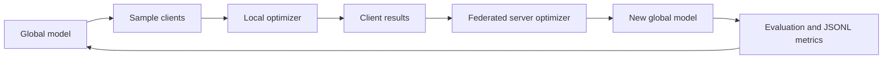

# Federated Optimization Framework

[简体中文](README_zh-CN.md) · [Getting started](docs/GETTING_STARTED.md) · [Algorithms](docs/ALGORITHMS.md) · [Contributing](CONTRIBUTING.md)

A compact, beginner-friendly PyTorch framework for learning, comparing, and extending
federated optimization algorithms. It keeps the training loop readable, exposes local
and server optimization as separate components, and includes tests for every advertised
algorithm.

> This repository is a clean general-purpose rewrite. It intentionally contains no
> FedHodge, FedMZ, DriVE, unpublished method, experiment archive, or private research
> artifact from the project that inspired it.

## Why this project exists

The first federated-learning experiment is often slowed down by infrastructure rather
than ideas: client sampling, non-IID partitions, local training, state-dict aggregation,
evaluation, configuration, and reproducibility. This project provides those pieces in a
small codebase so students can spend their time understanding and improving algorithms.

It is designed for:

- students learning how federated optimization works;
- researchers who need a transparent baseline implementation;
- teachers who want runnable examples without a distributed-systems stack;
- contributors adding a local optimizer or server rule behind a stable interface.

## Included methods

### Federated methods

| Family | Methods | Where the special logic lives |
|---|---|---|
| Basic | FedSGD, FedAvg | client steps and weighted server averaging |
| Heterogeneity-aware | FedProx, SCAFFOLD, FedNova | proximal loss, control variates, normalized updates |
| Server momentum/adaptivity | FedAvgM, FedAdagrad, FedAdam, FedYogi | stateful server optimizer |
| Robust aggregation | coordinate Median, Trimmed Mean, Krum | server aggregation rule |

### Local optimizers

`SGD`, momentum SGD, Nesterov SGD, `Adam`, `AdamW`, `Adagrad`, `Adadelta`,
`RMSprop`, `Rprop`, `ASGD`, `RAdam`, and `NAdam` are available through one registry.
Step, multi-step, exponential, cosine, and linear local learning-rate schedules are also
included.

See [docs/ALGORITHMS.md](docs/ALGORITHMS.md) for equations, assumptions, and recommended
starting configurations. In particular, this compact SCAFFOLD and FedNova implementation
deliberately requires plain SGD with no momentum or local scheduler so its normalization
matches the documented formula.

## Quick start

```bash
git clone https://github.com/qinghuiya/Federated-Optimization-Framework.git
cd Federated-Optimization-Framework
python -m venv .venv
```

Activate the environment, then install and run the download-free synthetic example:

```bash
pip install -e .
fedopt-train --config configs/synthetic_fedavg.yaml --output outputs/first-run
```

Try another federated method and another local optimizer without editing YAML:

```bash
fedopt-train --config configs/synthetic_fedavg.yaml \
  --algorithm fedadam --optimizer adamw --rounds 10 \
  --output outputs/fedadam-adamw
```

Run the tests:

```bash
pip install -e ".[dev]"
pytest
```

## A readable configuration

```yaml
data:
  name: synthetic                 # synthetic, mnist, fashionmnist, cifar10, cifar100
  num_clients: 20
  batch_size: 32
  partition:
    name: dirichlet               # iid, dirichlet, shard
    alpha: 0.5

model:
  name: mlp                       # mlp, simple_cnn, resnet18

local:
  epochs: 1                       # use either epochs or steps
  optimizer:
    name: sgd
    lr: 0.05

federated:
  algorithm: fedavg
  rounds: 20
  participation: 0.25
  server: {}
```

Ready-to-run examples live in [`configs/`](configs). `synthetic_fedavg.yaml` needs no
network or dataset download; the MNIST and CIFAR examples download data through
TorchVision on first use.

## How a round flows



The important extension points are intentionally small:

- [`federated_optimization/local.py`](federated_optimization/local.py) creates local optimizers;
- [`federated_optimization/client.py`](federated_optimization/client.py) defines client training;
- [`federated_optimization/server.py`](federated_optimization/server.py) defines aggregation and server optimization;
- [`federated_optimization/runner.py`](federated_optimization/runner.py) owns the experiment loop.

Each run writes `resolved_config.yaml`, per-round `metrics.jsonl`, `summary.json`, and
`final_model.pt` under the selected output directory.

## Scope and honest limitations

This is a single-process simulation framework: clients train sequentially on one CPU or
GPU. That makes algorithms easy to inspect and debug, but it is not a production secure
aggregation system. It currently targets supervised classification and does not claim
differential privacy, communication encryption, fault-tolerant networking, or benchmark
parity with large distributed platforms.

Batch-normalization statistics are aggregated like other model state in the standard
methods. Robust aggregators are unweighted coordinate rules. FedNova implements the
plain-SGD normalization case and does not silently approximate momentum corrections.

## Contributing

New optimizers, datasets, tests, documentation fixes, and beginner examples are welcome.
Read [CONTRIBUTING.md](CONTRIBUTING.md) and [docs/EXTENDING.md](docs/EXTENDING.md) before
opening a pull request. Please include a source citation and a small numerical test for a
new algorithm.

## License and citation

Released under the [MIT License](LICENSE). If this framework helps your teaching or
research, cite the software metadata in [CITATION.cff](CITATION.cff) and cite the original
algorithm papers listed in [docs/ALGORITHMS.md](docs/ALGORITHMS.md).
